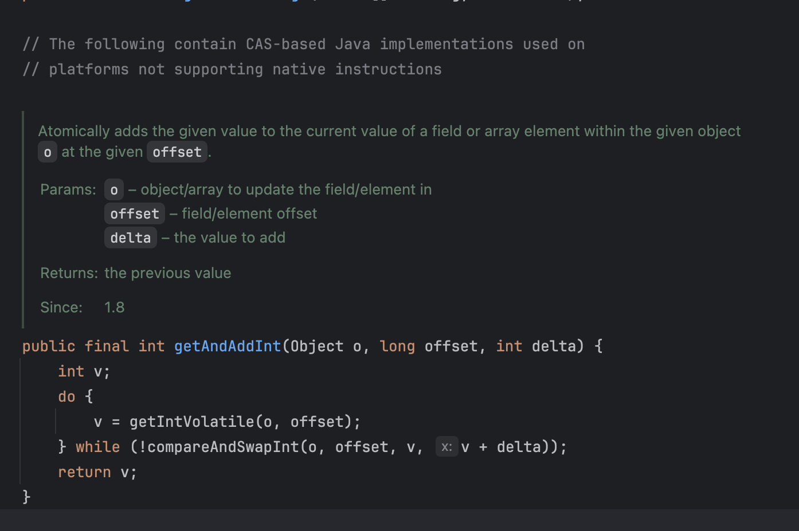

## 동시성

"동시성 이슈 (concurrency issue)"는 **여러 작업이 동시에 같은 자원에 접근하여 변경할 때 발생하는 문제**를 말한다.
<br>

>  데이터베이스에 동시에 접근하여 수정을 하려한다면? 

위와 같은 문제를 해결하기 위해 데이터베이스의 락(Lock)을 사용하여 충돌을 방지한다.
- 테이블에 접근시 락이 걸려있으면 수정이 불가하고 락이 풀려 있을 때만 수정이 가능하다.
- 테이블을 수정한다면 내가 이 값을 수정한다고 선점

### Lock?
멀티스레드 환경(또는 여러 트랜잭션 환경)에서 공유 자원을 동시에 수정하려할떄의 데이터 충돌
<br>
**-> 이를 막기 위한 전략이 락 (Lock)이다.**

---

## 낙관적 락 (Optimistic Lock) vs 비관적 락 (Pessimistic Lock)
> 충돌을 해결하기 위한 락 메커니즘
 
### 낙관적 락
- "왠만하면 다른 사람이 데이터를 안 거드릴 거야"라는 락을 걸지 않다가, 최종 커밋 전에 충돌을 감지한다.
- 충돌하면 **재시도** 또는 **실패 처리**

#### 장점 
- 락을 걸지 않으므로 비관적 락 보다 성능이 우수하다.
- 충돌이 적은 상황에서 매우 효율적이다.

#### 단점
- 충돌 발생시 비용이 발생한다. 
- **충돌이 많으면** 성능 저하가 발생한다.

#### 대표적 예
```sql
UPDATE coupon SET quantity = quantity - 1, version = version + 1
WHERE id = 1 AND version = 3;
```
버전이 일치하지 않으면 실패한다!!

```java 
@Version
private Integer version;
```
JPA로 구현한 낙관적 락

### 비관적 락
- "다른 누군가가 데이터를 수정될 것"이다라는 가정으로 미리 락을 걸어, 공유자원(스레드/트랜잭션)에 접근하지 못하게 하는 것

#### 장점
- 충돌을 사전에 방지한다. 
- 데이터 정합성 확보에 굉장히 명확한 방식 

#### 단점
- 락으로 인해 대기 시간이 생긴다. (누군가가 작업이 끝날때까지 대기를 해야하므로!)
- 데드락 위험이 있음 ( 두개 이상의 트랜잭션이 서로가 가진 락을 기다리면서 무한정 대기하는 상태 )
- **락이 많아 질수록** 성능이 저하된다.

### 대표적 예
```sql
SELECT * FROM coupon WHERE id = 1 FOR UPDATE;
```
다른 트랜잭션이 데이터를 건드리지 못하도록 즉시 락을 건다.

```java
public interface CouponRepository extends JpaRepository<Coupon, Long> {

    @Lock(LockModeType.PESSIMISTIC_WRITE)
    @Query("SELECT c FROM Coupon c WHERE c.id = :id")
    Optional<Coupon> findByIdForUpdate(@Param("id") Long id);
}
```
물론 JPA에서도 LockModeType을 통해 비관적 락을 설정할 수 있다

---

## Syncronized
### 비관적 락의 대표적인 예
> 자바에서 가장 기본적인 락 메커니즘

하나의 스레드만 특정 블록/메서드에 접근 가능하도록 한다.
<br> 공유 자원 접근 전 선제적으로 락을 건다.
**다른 스레드는 락이 풀릴 때 까지 대기한다.**

```java
public synchronized void increment() {
    count++;
}

public void increment() {
  synchronized (this) {
    count++;
  }
}
```

### 문제점
syncronized는 단일 JVM 에서만 유효하다. 
<br>같은 메모리 공간에서만 유효하다는 말인 즉슨, MSA 구조와 같은 서버가 여러대인 공간에서 문제가 발생할 수 있다.

> MSA 환경에서 여러 서버가 같은 쿠폰 번호를 발급하거나, 같은 재고를 차감하는 로직을 수행한다면?
>> 서버 A,B,C는 자기 서버의 JVM 기준의 락을 걸기 떄문에 각각의 서버가 동시에 같은 쿠폰을 발급할 수 있다.

## Atomic class
### 낙관적 락의 대표적인 예
데이터를 가져오고 시도, 그 후 실패시 다시 반복 (낙관적 락 메커니즘)<br>
어떤 스레드도 락 영향을 받지 않기 때문에 context stwitching 비용이 절감한다.

#### CAS (Compare And Set) 알고리즘

CAS 알고리즘을 베이스로 구현되어진 getAndAddInt

```java

public class AtomicInteger extends Number implements java.io.Serializable {
private static final long serialVersionUID = 6214790243416807050L;

    // setup to use Unsafe.compareAndSwapInt for updates
    private static final Unsafe unsafe = Unsafe.getUnsafe();
    private static final long valueOffset;

    static {
        try {
            valueOffset = unsafe.objectFieldOffset
                (AtomicInteger.class.getDeclaredField("value"));
        } catch (Exception ex) { throw new Error(ex); }
    }

    private volatile int value;
```
AtomicInteger 내부에는 volatile과 함께 변수가 선언되어있다.
> volatile? 변수의 값을 Read&Write할 때마다 CPU cache가 아닌 Main Memory에서 읽는 것

멀티스레드 환경에서 여러 Thread가 해당 자원에 접근을 하게되는 상황이라면 동일한 메모리의 자원을 접근해야한다.
<br> 가령 1번 스레드가 CPU cache에 접근하고 2번 스레드가 Main Memory cache에 논리적 연산이 정상적이지 않게 나오는 경우가 발생한다.
<br><br>
모든 스레드가 value의 최신값을 볼 수 있게 보장 (가시성)하며 AtomicInteger 내 JVM 정합성을 보장하기 위해 ( CAS 성공 후 다른 스레드에 반영되어야 함 ) volatile 변수가 선언되었다 할 수 있다.
<br><br>
=> 가시성과 동시성은 별개의 문제로 구분해야 한다.  
---

