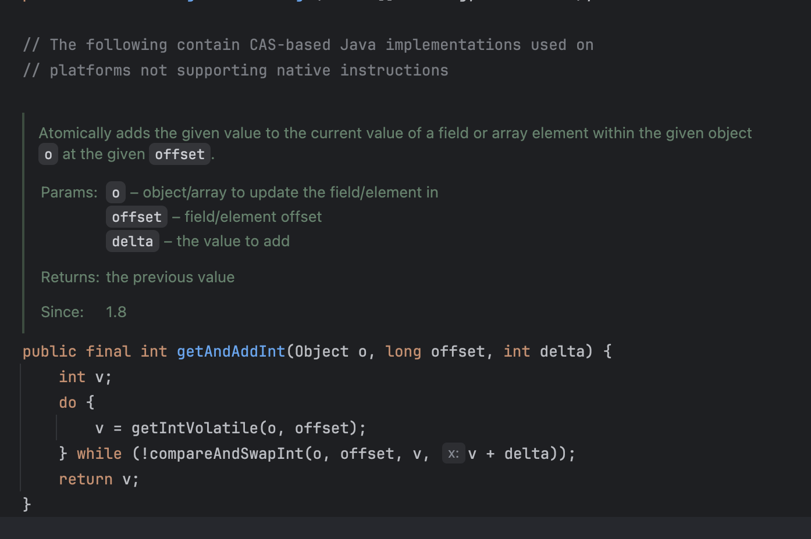

## 동시성 제어 기법

#### CAS (Compare And Set) 알고리즘
- 낙관적 락 기반의 동시성 제어 기법
- 현재값이 예상하는 값과 같다면 새값으로 원자적(atomic)하게 교체


CAS 알고리즘을 베이스로 구현되어진 getAndAddInt

```java

public class AtomicInteger extends Number implements java.io.Serializable {
private static final long serialVersionUID = 6214790243416807050L;

    // setup to use Unsafe.compareAndSwapInt for updates
    private static final Unsafe unsafe = Unsafe.getUnsafe();
    private static final long valueOffset;

    static {
        try {
            valueOffset = unsafe.objectFieldOffset
                (AtomicInteger.class.getDeclaredField("value"));
        } catch (Exception ex) { throw new Error(ex); }
    }

    private volatile int value;
```
AtomicInteger 내부에는 volatile과 함께 변수가 선언되어있다.
> volatile? 변수의 값을 Read&Write할 때마다 CPU cache가 아닌 Main Memory에서 읽는 것

멀티스레드 환경에서 여러 Thread가 해당 자원에 접근을 하게되는 상황이라면 동일한 메모리의 자원을 접근해야한다.
<br> 가령 1번 스레드가 CPU cache에 접근하고 2번 스레드가 Main Memory cache에 논리적 연산이 정상적이지 않게 나오는 경우가 발생한다.
<br><br>
모든 스레드가 value의 최신값을 볼 수 있게 보장 (가시성)하며 AtomicInteger 내 JVM 정합성을 보장하기 위해 ( CAS 성공 후 다른 스레드에 반영되어야 함 ) volatile 변수가 선언되었다 할 수 있다.
<br><br>
=> 가시성과 동시성은 별개의 문제로 구분해야 한다.
---

#### Mutex (Mutual Exclusion)
- 비관적 락 기반 자원 보호 알고리즘
- 한 번의 하나의 스레드만 임계 구역에 들어갈 수 있도록 하는 락 객체
    - syncronized가 이에 속한다.

#### Semaphore (세마포어)
- 한정된 자원을 관리하는 동시성 제어 도구, 최대 N개의 스레드가 동시에 접근할 수 있도록 허용하는 카운터 기반 락
    - DB 커넥션풀 ( 커넥션을 반환하면 대기중인 커넥션이 사용을 한다.)